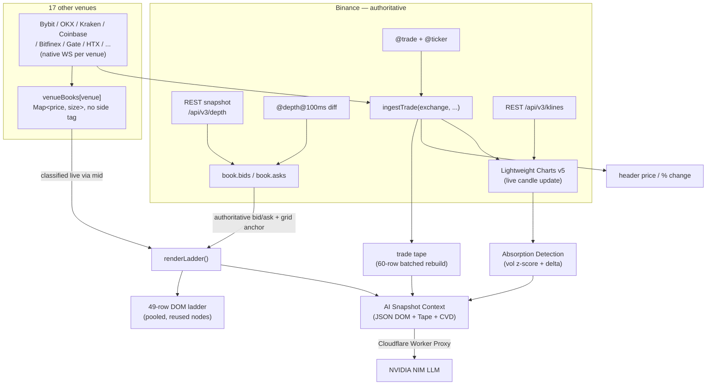

# DOM Ladder — Multi-Venue BTCUSDT

A single-file BTCUSDT depth-of-market ladder, trade tape, and charting terminal, aggregating resting order size across 18 exchange feeds directly in the browser. No build step, no local server — open the HTML file and it connects directly to each exchange's public WebSocket API from the client, with an optional AI analyst panel powered by a Cloudflare proxy.

## Contents

- [Features](#features)
- [Quick start](#quick-start)
- [How it works](#how-it-works)
- [Venue reference](#venue-reference)
- [Ladder anatomy](#ladder-anatomy)
- [Configuration](#configuration)
- [Performance](#performance)
- [Known limitations](#known-limitations)
- [Browser requirements](#browser-requirements)
- [File map](#file-map)
- [Disclaimer](#disclaimer)

## Features

- **18-venue combined order book.** Binance spot is the authoritative reference (snapshot + diff stream, gap-detected auto-resync); 17 other venues stream directly into the same combined ladder.
- **2-column ladder** — Size, Price — with ask rows tinted red and bid rows tinted green, brighter on round "major" price levels (every 10 ticks).
- **Wall highlighting** — any price level holding more than 75% of the currently visible max size gets a glow.
- **Chase tracker** — a small dot on the best bid/ask price cell that brightens with sustained directional movement and fades on a stall or reversal.
- **Multi-venue trade tape** — every trade across all 18 feeds, color-coded by exchange via a left border.
- **Lightweight Charts v5 panel.** Togglable bottom chart with selectable timeframes (1m–4h), OHLC candles, and a buy/sell volume delta histogram.
- **Volume-scaled absorption bubbles.** Automatically plots `B` (green, market absorbing sells) and `S` (red, market absorbing buys) markers on the chart based on volume z-scores and subsequent price rejection.
- **AI Orderflow Analyst.** Integrated side panel (LLM via NVIDIA NIM) that ingests a comprehensive JSON snapshot of the DOM, tape, CVD, and chart state to provide real-time orderflow analysis, with optional screen-capture cross-referencing.
- **Live feed count and connection status** in the header.
- **Adjustable tick size** — regroups the whole ladder into wider or narrower price buckets on the fly.
- **Fully client-side core.** No backend required for the ladder/tape/chart. The AI feature uses a lightweight Cloudflare Worker proxy to protect the API key.

## Quick start

Open the HTML file in a browser. The ladder and tape connect immediately. 
- To use the **Chart**, click the chart icon and select a timeframe to fetch historical klines.
- To use the **AI Analyst**, click the robot icon, enter your NVIDIA NIM API key (stored locally in `localStorage`), and ask questions about the current orderflow.

## How it works

Binance is the *authoritative* book: it's the only venue with true bid/ask separation (`book.bids` / `book.asks`, kept in sync via Binance's standard snapshot-then-diff procedure — REST `/api/v3/depth` snapshot, buffered `@depth@100ms` diff events, gap detection on `U`/`u` sequence IDs with automatic resync). Binance's best bid/ask is what anchors the ladder's price grid, the mid used for classification, and the chase tracker.

The other 17 venues don't get their own bid/ask columns. Each one writes into a single `Map<price, size>` (no side tag) via `venueBooks[venue]`. At render time, every price from every venue map is classified live — `price <= mid → bid, price > mid → ask` — and summed into the same bucketed arrays Binance's book feeds. This is why removing a resting order from one venue can never clobber another venue's size sitting at the same price: each venue keeps its own map, and only the *bucketed sum* is shared.



Rendering is decoupled from message frequency: incoming WebSocket messages just set a `dirty` flag and touch data structures — nothing paints synchronously. A single `requestAnimationFrame` loop checks the flag and repaints at most every 120ms (~8/sec), regardless of whether 1 or 100 updates arrived in that window. The trade tape works the same way — trades queue into an array, and the visible list (capped at 60 rows) is rebuilt with one bounded `innerHTML` write per tick instead of a DOM mutation per trade.

The **Chart module** uses Lightweight Charts v5 (loaded asynchronously via CDN with a dual-fallback). It fetches historical klines from Binance REST and updates the live candle via the aggregated trade tape. A rolling 20-period volume mean/stdev is computed to detect absorption: high-volume candles (z-score > 1.5) that fail to continue in the direction of their aggressive delta are flagged with volume-scaled markers (`B` for sell-absorption, `S` for buy-absorption).

The **AI module** generates a deterministic JSON snapshot (`aiSnapshotContext()`) containing the exact DOM ladder, depth profile, venue dislocation, CVD, and recent 10s OHLC candles. This is sent to a Cloudflare Worker proxy (to hide the API key and handle NVIDIA's streaming quirks) alongside an optional `getDisplayMedia` screenshot.

Each non-Binance venue connects through a shared `makeVenueWS()` wrapper handling reconnect with exponential backoff (starts at 1.5s, ×1.6 per attempt, capped at 30s), a keepalive ping where the venue's protocol requires one, and gzip-compressed frame decoding (via the browser's native `DecompressionStream`) for the three venues — Bitfinex, HTX, BingX — that push binary-compressed WebSocket frames.

## Venue reference

| Venue | Market | Symbol | Depth feed | Notes |
|---|---|---|---|---|
| Binance | Spot | `btcusdt` | Snapshot + diff (authoritative) | Reference book; also `@trade`+`@ticker` for tape/header |
| Binance Futures | USDⓈ-M Perp | `btcusdt` | Snapshot push, top 20 @ 500ms | `aggTrade` + `depth20` combined stream |
| Bybit | Spot | `BTCUSDT` | Snapshot + delta | `orderbook.200`, 20s ping |
| Bybit Linear | USDT Perp | `BTCUSDT` | Snapshot + delta | `orderbook.500`, 20s ping |
| OKX | Spot | `BTC-USDT` | Snapshot + delta | `books` channel, 25s text ping |
| OKX Futures | Perp Swap | `BTC-USDT-SWAP` | Snapshot + delta | `books` channel, 25s text ping |
| Gate.io | Spot | `BTC_USDT` | Snapshot push | `spot.order_book`, 20s JSON ping |
| Bitget | Spot | `BTCUSDT` | Snapshot push | `books15`, 25s text ping |
| Bitstamp | Spot | `btcusdt` | Snapshot push | `order_book_*`, no ping needed |
| Gemini | Spot | `BTCUSD` | Delta only | `l2_updates`, no ping needed |
| Kraken | Spot | `BTC/USDT` | Snapshot + delta | v2 `book` channel, 30s JSON ping |
| Coinbase | Spot | `BTC-USDT` | Snapshot + delta (client-reconstructed) | `level2`, no ping needed |
| Bitfinex | Spot | `tBTCUSD` | Snapshot + delta | raw book P0/F0, gzip-capable, no ping |
| HTX (Huobi) | Spot | `btcusdt` | Snapshot push | `depth.step0`, always gzip, protocol ping/pong |
| Poloniex | Spot | `BTC_USDT` | Snapshot + delta | `book_lv2`, 30s JSON ping |
| BingX | Spot | `BTC-USDT` | Snapshot push | `@depth`, gzip-capable, text `Ping`/`Pong` |
| WOO X | Spot | `SPOT_BTC_USDT` | Snapshot push | `@orderbook`, 25s JSON ping |
| Deribit | Perp | `BTC_USDT` | Snapshot + delta | `book.100ms`, 30s JSON-RPC ping |

**Not included:** KuCoin and Phemex require a signed/authenticated connection or a CORS proxy that only exists behind a backend — not reachable from a standalone client-side file. MEXC is disabled at the source (the legacy terminal this was ported from disables it unconditionally too).

## Ladder anatomy

- **Size / Price** — the only two columns. Size is resting order size at that price, aggregated across every connected venue; which side it's on is conveyed by row color, not column position.
- **Red rows** = ask side (above spread), **green rows** = bid side (below spread), both brighter on major price levels (multiples of 10× the current tick).
- **Center spread row** — divider showing best-ask minus best-bid.
- **Glowing size text** — a wall: that price level holds over 75% of the currently visible maximum size.
- **Purple outline on price** — the row nearest the last executed trade price.
- **Small dot on best bid/ask** — the chase tracker; opacity ramps up with consecutive same-direction best-price moves and decays on a stall or reversal.

## Configuration

- **TICK** field in the ladder footer sets the price bucket width (defaults to 0.5). Changing it regroups every row on the next render.
- **Chart Timeframes** — selectable in the chart header (1m, 5m, 15m, 1h, 4h). Triggers a REST fetch to Binance for historical klines.
- **AI API Key** — required for the AI panel. Stored in `localStorage` under `nim_api_key`.

## Performance

The render loop and tape both went through a couple of rounds of tightening:

- Ladder repaint throttled to ~8/sec instead of running on every dirty animation frame.
- Cross-venue best-bid/ask extension pass removed — venues now only feed the bucket sums, not the reference best price.
- Trade tape rebuilds as one bounded `innerHTML` write (max 60 rows) per tick instead of a DOM insert+evict pair per trade.
- Chart updates and AI snapshot generation run asynchronously and never block the 18-venue socket loop or the 120ms render tick.
- Unnecessary `toFixed`/string round-trips in the hot bucketing path removed in favor of pure arithmetic.

## Known limitations

- **BTCUSDT only** — no symbol switching; every venue's symbol is hardcoded in `SYM_BTC`.
- **Best bid/ask is Binance-only** — other venues contribute to the aggregated size figures and the tape, but not to the reference spread/price shown in the header or spread row (a deliberate speed trade-off).
- **Minimal persistence** — refreshing the page drops all local market state. Only the NVIDIA NIM API key is cached in `localStorage`.
- **Liquidity is exchange-reported, not executable-guaranteed** — resting size can include iceberg orders, partial fills in flight, or stale levels during a venue's own resync; treat the ladder as a liquidity *indicator*, not a guarantee of fillable size.

## Browser requirements

Needs the [`DecompressionStream`](https://developer.mozilla.org/en-US/docs/Web/API/DecompressionStream) API (used to decode gzip-compressed frames from Bitfinex, HTX, and BingX): Chrome/Edge 80+, Firefox 113+, Safari 16.4+. 
The optional AI screen-capture feature requires [`getDisplayMedia`](https://developer.mozilla.org/en-US/docs/Web/API/MediaDevices/getDisplayMedia) support and user permission.

## File map

Single HTML file, roughly 1480 lines. External requests are limited to the exchange endpoints, a Google Fonts stylesheet, the Lightweight Charts CDN (with dual-fallback), and the AI Cloudflare Worker proxy.

| Lines | Section |
|---|---|
| 1–195 | `<style>` & HTML markup — theme, layout, ladder, tape, AI panel, chart panel |
| 196–250 | Constants, shared state, formatting/bucketing utilities |
| 251–480 | Multi-venue infra — `venueBooks`, reconnect/backoff, gzip decode, `A` venue map |
| 481–680 | Ladder pool, chase tracker, `renderLadder()`, `paintLadder()`, tape loop |
| 681–830 | Binance authoritative feed — depth snapshot+diff, trade/ticker stream |
| 831–1180 | AI Panel — JSON snapshot context, screen capture, Cloudflare worker proxy, UI wiring |
| 1181–1480 | Chart Module — Lightweight Charts v5, klines fetch, rolling volume, absorption detection |

## Disclaimer

Personal/educational trading tool, not financial advice. Displayed depth is a sum of self-reported resting order sizes across venues at a point in time and can diverge from true executable liquidity. All of this code was purely written by AI, use with awareness.

## License

Open-Source under the [MIT License](https://github.com/WisTex/The-MIT-License-Files/blob/main/LICENSE)
```
